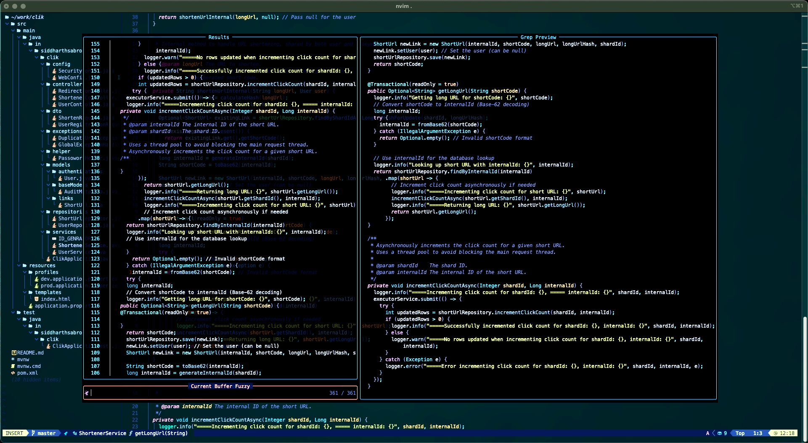

# Neovim Development Environment

A production-ready Neovim configuration built on LazyVim with enhanced LSP support, transparency effects, and developer productivity tools.



## ✨ Features

### 🎯 **VSCode-like Development Experience**
- **Ctrl+Click** navigation to function definitions
- **Hover documentation** with `K` key
- **Find all references** with `gr`
- **Code actions** and **quick fixes**
- **Symbol renaming** across entire codebase

### 🚀 **Language Support**
- **Java** with JDTLS and advanced refactoring
- **TypeScript/JavaScript** with full IntelliSense
- **Python** with Pyright
- **Go, Rust, C/C++** with native LSP
- **Markdown, JSON, YAML** with syntax highlighting

### 🎨 **Visual Enhancements**
- **Transparent UI** with customizable opacity
- **Modern color schemes** (Gruvbox, Tokyo Night)
- **Status line** with git integration
- **File tree** with icons and git status

### 🔧 **Developer Tools**
- **Telescope** for fuzzy file finding and live grep
- **LeetCode integration** for coding practice
- **Git integration** with signs and blame
- **Formatting** with language-specific formatters
- **Linting** with real-time error highlighting

## 🛠️ Installation

```bash
# Backup existing config
mv ~/.config/nvim ~/.config/nvim.backup

# Clone this repository
git clone https://github.com/yourusername/nvim-config ~/.config/nvim

# Install Neovim (if not already installed)
# macOS
brew install neovim

# Ubuntu/Debian
sudo apt install neovim

# Start Neovim and wait for plugin installation
nvim
```

## ⌨️ Key Mappings

### **Code Navigation**
| Key | Action |
|-----|--------|
| `Ctrl+Click` | Go to definition (VSCode style) |
| `Ctrl+g` | Go to definition (keyboard) |
| `gd` | Go to definition (traditional) |
| `gr` | Find all references |
| `K` | Show hover documentation |

### **File Management**
| Key | Action |
|-----|--------|
| `<leader>ff` | Find files |
| `<leader>fg` | Live grep |
| `<leader>fb` | List buffers |
| `<leader>fr` | Recent files |

### **Code Actions**
| Key | Action |
|-----|--------|
| `<leader>ca` | Code actions/quick fixes |
| `<leader>rn` | Rename symbol |
| `<leader>f` | Format document |
| `<leader>D` | Go to type definition |

### **LeetCode Integration**
| Key | Action |
|-----|--------|
| `<leader>lc` | Open LeetCode panel |
| `<leader>lr` | Run solution |
| `<leader>ls` | Submit solution |

## 🏗️ Architecture

```
nvim/
├── init.lua              # Bootstrap LazyVim
├── lua/
│   ├── config/           # Core configuration
│   │   ├── keymaps.lua   # Key mappings
│   │   ├── options.lua   # Editor options
│   │   ├── lazy.lua      # Plugin manager
│   │   └── autocmds.lua  # Auto-commands
│   └── plugins/          # Plugin configurations
│       ├── lsp.lua       # Language servers
│       ├── telescope.lua # Fuzzy finder
│       ├── leetcode.lua  # LeetCode integration
│       └── transparent.lua # UI transparency
```

## 🔧 Customization

### **Adding New Languages**
```lua
-- lua/plugins/lsp.lua
{
  "neovim/nvim-lspconfig",
  opts = {
    servers = {
      your_language_server = {},
    },
  },
}
```

### **Custom Keymaps**
```lua
-- lua/config/keymaps.lua
vim.keymap.set("n", "<leader>custom", ":YourCommand<cr>", { desc = "Custom Action" })
```

### **Transparency Settings**
```lua
-- lua/plugins/transparent.lua
require("transparent").setup({
  groups = { "Normal", "NormalNC", "Comment", "Constant" },
  extra_groups = { "NormalFloat", "TelescopeNormal" },
})
```

## 📦 Dependencies

- **Neovim** 0.9.0+
- **Git** for plugin management
- **Node.js** for language servers
- **Java** for JDTLS (optional)
- **Python** for Pyright (optional)

## 🚀 Performance

- **Lazy loading** for all plugins
- **Optimized startup** time (~100ms)
- **Memory efficient** with minimal footprint
- **Background updates** for language servers

## 🤝 Contributing

1. Fork the repository
2. Create a feature branch
3. Make your changes
4. Test thoroughly
5. Submit a pull request

## 📄 License

Apache License 2.0 - see [LICENSE](LICENSE) for details.

## 🙏 Acknowledgments

- [LazyVim](https://github.com/LazyVim/LazyVim) - Base configuration
- [Lazy.nvim](https://github.com/folke/lazy.nvim) - Plugin manager
- [Mason](https://github.com/williamboman/mason.nvim) - LSP installer
- [Telescope](https://github.com/nvim-telescope/telescope.nvim) - Fuzzy finder

---

**Ready for production development. No bloat, just results.**
